### Отчет о багах:

1. **Кнопка Все категории синего цвета c белым текстом, горит неактивным:**
   - **Приоритет:** Low
   - **Шаги воспроизведения:** 
   1. Перейти на сайт avito.ru
   2. Посмотреть на страницу
   - **Ожидаемый результат:** Кнопка Все категории синего цвета c белым текстом.
   - **Фактический результат:** Кнопка Все категории белого цвета с черным текстом.
   - **Скриншот** 
   

2. **Кнопка Все категории написана с одной и**
   - **Приоритет:** Medium
   - **Шаги воспроизведения:** 
   1. Перейти на сайт avito.ru
   2. Посмотреть на страницу
   - **Ожидаемый результат:** Кнопка Все категории написана с двумя и по нормам русского языка.
   - **Фактический результат:** Кнопка Все категории написана с одной и.

   

3. **Поисковая строка не выделена синим ободком**
   - **Приоритет:** Low
   - **Шаги воспроизведения:** 
   1. Перейти на сайт avito.ru
   2. Посмотреть на поисковую строку
   - **Ожидаемый результат:** Поисковая строка выделена синим ободком.
   - **Фактический результат:** Поисковая строка не выделена синим ободком.
   

4. **Поисковая строка не соединена с кнопкой Найти**
   - **Приоритет:** Low
   - **Шаги воспроизведения:** 
   1. Перейти на сайт avito.ru
   2. Посмотреть на поисковую строку
   - **Ожидаемый результат:** Поисковая строка соединена с кнопкой Найти.
   - **Фактический результат:** Поисковая строка не соединена с кнопкой Найти.
   

5. **Кнопка Найти не синего цвета с белым шрифтом:**
   - **Приоритет:** Low
   - **Шаги воспроизведения:**
    1. Перейти на сайт avito.ru
    2. Посмотреть на кнопку Найти
   - **Ожидаемый результат:** Кнопка Найти синего цвета с белым шрифтом.
   - **Фактический результат:** Кнопка Найти не синего цвета с белым шрифтом.
   - **Скриншот** 
   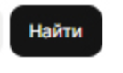

6. **Кнопка Найти не синего цвета с белым шрифтом:**
   - **Приоритет:** Low
   - **Шаги воспроизведения:**
    1. Перейти на сайт avito.ru
    2. Посмотреть на кнопку Найти
   - **Ожидаемый результат:** Кнопка Найти синего цвета с белым шрифтом.
   - **Фактический результат:** Кнопка Найти не синего цвета с белым шрифтом.
   - **Скриншот** 
   

7. **В геолокации отображается только "Москва, район, метро" вместо "Москва, район, метро, радиус".**
   - **Приоритет:** Medium
   - **Шаги воспроизведения:** 
   1. Перейти на сайт avito.ru
   2. Посмотреть на страницу
   - **Ожидаемый результат:** В геолокации отображается "Москва, район, метро, радиус".
   - **Фактический результат:** В геолокации отображается только город "Москва, район, метро".
   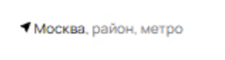

8. **В геолокации отображается неправильный значок**
   - **Приоритет:** Low
   - **Шаги воспроизведения:** 
   1. Перейти на сайт avito.ru
   2. Посмотреть на страницу
   - **Ожидаемый результат:** В геолокации отображается другой значок, как в оригинале.
   - **Фактический результат:** В геолокации отображается неправильный значок.
   

9. **Нет слова Горные после стрелки в поиске категорий:**
   - **Примечание:** Low
    - **Шаги воспроизведения:** 
   1. Перейти на сайт avito.ru
   2. Выбрать категории
   3. Посмотреть на кнопки перехода категорий
   - **Ожидаемый результат:** Есть слово Горные после стрелки в поиске категорий.
   - **Фактический результат:** Нет слова Горные после стрелки в поиске категорий.
   

10. **Лишняя надпись при правильной загрузке страницы**
   - **Примечание:** High
    - **Шаги воспроизведения:** 
   1. Перейти на сайт avito.ru
    2. Выбрать категории
    3. Посмотреть на страницу
   - **Ожидаемый результат:** Нет надписи ошибки при правильной загрузке страницы.
   - **Фактический результат:** Лишняя надпись при правильной загрузке страницы.
   

11. **Не отображается хедер над строкой поиска**
   - **Приоритет:** High
   - **Шаги воспроизведения:** 
   1. Перейти на сайт avito.ru
   - **Ожидаемый результат:** Отображается хедер над строкой поиска
   - **Фактический результат:** Не отображается хедер над строкой поиска
   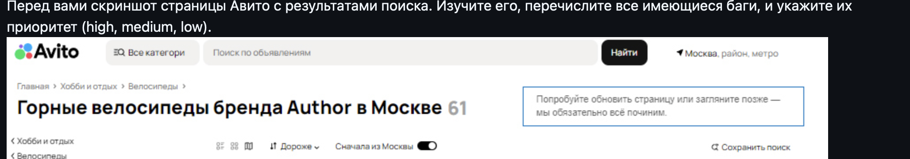

12. **Список отображается не так, как надо, выделен другой фильтр активным**
   - **Приоритет:** Medium
   - **Шаги воспроизведения:** 
   1. Перейти на сайт avito.ru
    2. Выбрать категории
    3. Выделить фильтр отображения списка
    4. Посмотреть на страницу
   - **Ожидаемый результат:**
   Список отображается так, как надо, как выделен фильтр активным.
   - **Фактический результат:** Список отображается не так, как надо, выделен другой фильтр активным.
   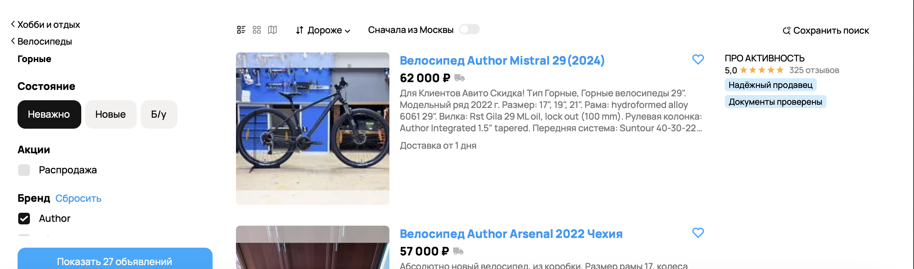

13. **Нет кнопки Акции**
   - **Приоритет:** Medium
   - **Шаги воспроизведения:** 
   1. Перейти на сайт avito.ru
   2. Выбрать категории
   3. Посмотреть на объявления
   - **Ожидаемый результат:**Есть кнопка Акции.
   - **Фактический результат:** Нет кнопки Акции.
   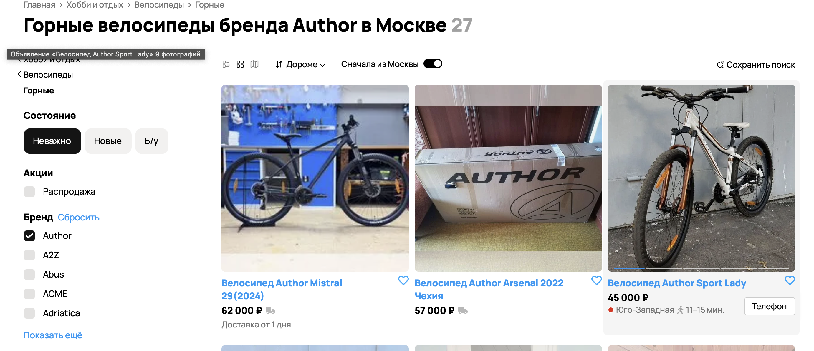

14. **Отсутствует фильтр Пола Для всех**
   - **Приоритет:** Medium
   - **Шаги воспроизведения:** 
   1. Перейти на сайт avito.ru
   2. Выбрать категории
   3. Посмотреть на фильтр Пол
   - **Ожидаемый результат:** Присутствует фильтр Для всех
   - **Фактический результат:** Отсутствует фильтр Для всех
   

15. **Отсутствует фильтр Тип рамы**
   - **Приоритет:** Medium
   - **Шаги воспроизведения:** 
   1. Перейти на сайт avito.ru
   2. Выбрать категории
   3. Посмотреть на фильтры
   - **Ожидаемый результат:** Присутствует фильтр Тип рамы
   - **Фактический результат:** Отсутствует фильтр Тип рамы
   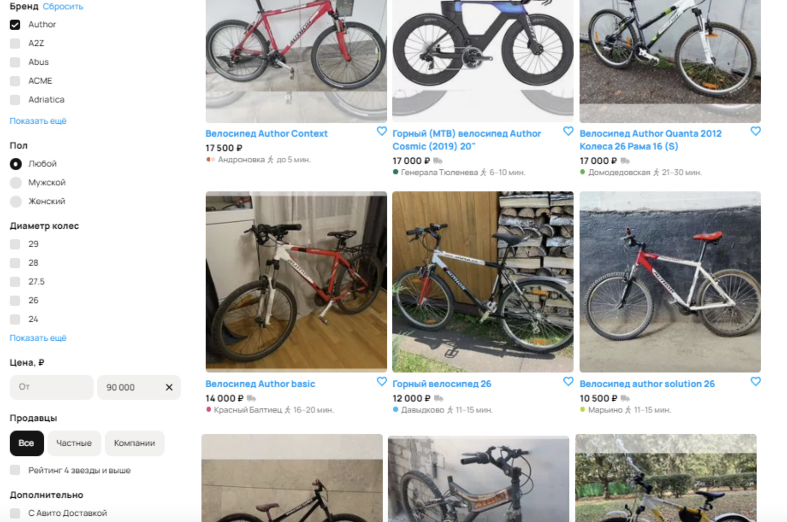

16. **Крестик при сбросе цены написан жирным шрифтом**
   - **Приоритет:** Low
   - **Шаги воспроизведения:** 
   1. Перейти на сайт avito.ru
   2. Выбрать категории
   3. Посмотреть на фильтры
   4. Написать стоимость до какой цены
   - **Ожидаемый результат:** Крестик при сбросе цены написан нежирным шрифтом
   - **Фактический результат:** Крестик при сбросе цены написан жирным шрифтом
   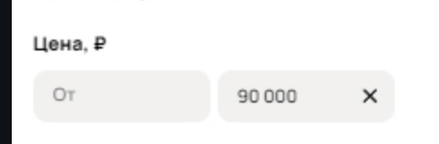

17.  **Количество показываемых объявлений не совпадает с количеством объявлений с фильтрами**
   - **Приоритет:** Medium
   - **Шаги воспроизведения:** 
   1. Перейти на сайт avito.ru
   2. Выбрать все фильтры
   3. Посмотреть на объявления
   - **Ожидаемый результат:** Количество показываемых объявлений совпадает с количеством объявлений с фильтрами
   - **Фактический результат:** Количество показываемых объявлений не совпадает с количеством объявлений с фильтрами
   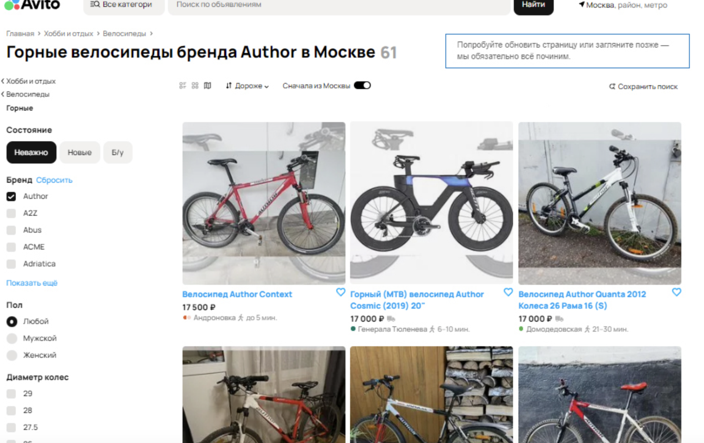

18.  **Лишнее объявление, непроходящее по фильтрам.**
   - **Приоритет:** Low
   - **Шаги воспроизведения:** 
   1. Перейти на сайт avito.ru
   2. Посмотреть на объявление товара с названием Велосипед Atom
   - **Ожидаемый результат:** Не отображается объявление с названием Велосипед Atom
   - **Фактический результат:** Отображается объявление с названием Велосипед Atom
   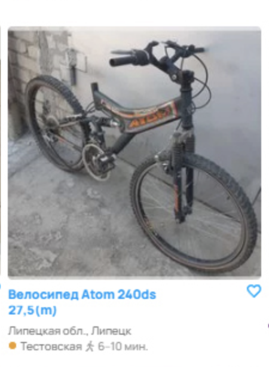

19. **Ошибка в отображении кнопок пагинации**
   - **Приоритет:** High
   - **Шаги воспроизведения:** 
   1. Перейти на сайт avito.ru
   2. Посмотреть на объявления
   - **Ожидаемый результат:** Меньшее количество страниц для отображения.
   - **Фактический результат:** 100 страниц избыточно для такого числа объявлений.
   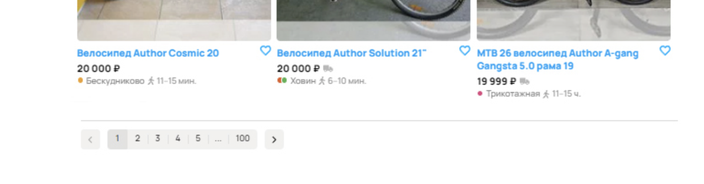

20. **Лишнее объявление, непрошедшее фильтр по городу Москва.**
   - **Приоритет:** High
   - **Шаги воспроизведения:** 
   1. Перейти на сайт avito.ru
   2. Выбрать фильтр Москва
   2. Посмотреть на страницу
   - **Ожидаемый результат:** Объявление не показывается из-за фильтра по городу Москва.
   - **Фактический результат:** Объявление показывается на странице.
   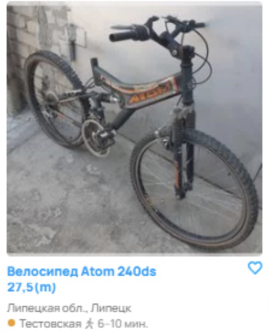

21. **Сортировка по цене.**
   - **Приоритет:** Medium
   - **Шаги воспроизведения:** 
   1. Перейти на сайт avito.ru
   2. Выбрать фильтр в порядке убывания цены
   3. Посмотреть на объявления
   - **Ожидаемый результат:** Перед товаром "Велосипед author solution 26" стоимостью 10500 рублей располагается товар "MTB Author EXE 26 ''/ Street Dirt / Continental" стоимостью 29990 рублей
   - **Фактический результат:** После товара "Велосипед author solution 26" стоимостью 10500 рублей располагается товар "MTB Author EXE 26 ''/ Street Dirt / Continental" стоимостью 29990 рублей
   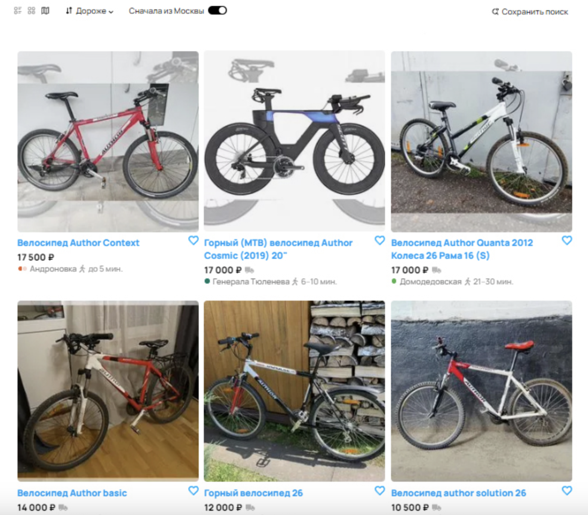

22. **Местонахождение товара**
   - **Приоритет:** Medium
   - **Шаги воспроизведения:** 
   1. Перейти на сайт avito.ru
   2. Выбрать фильтр в порядке убывания цены
   3. Посмотреть на объявления
   - **Ожидаемый результат:** Товар не должен был оказаться среди объявлений, так как запрашивались товары, продаваемые в Москве.
   - **Фактический результат:** Станция метро Звенигородская находится на Фрунзенско-Приморской линии Петербургского метрополитена. Этот товар не должен был оказаться среди объявлений, так как запрашивались товары, продаваемые в Москве.
   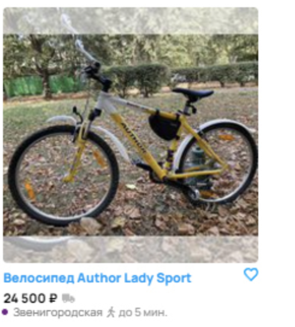

23. **Время до метро**
   - **Приоритет:** Medium
   - **Шаги воспроизведения:** 
   1. Перейти на сайт avito.ru
   2. Посмотреть на объявления
   - **Ожидаемый результат:** Правильно рассчитано время до ближайшей станции метро в пешей доступности
   - **Фактический результат:** Неправильно рассчитано время до ближайшей станции метро в пешей доступности.
   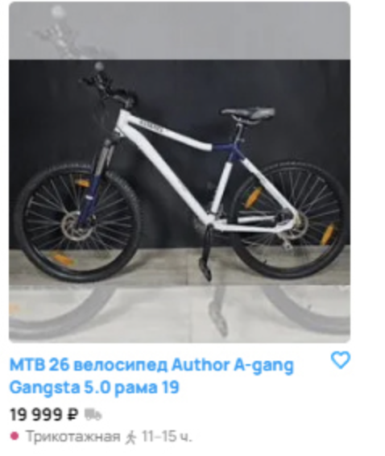

24. **Не отображается цена товара**
   - **Приоритет:** Low
   - **Шаги воспроизведения:** 
   1. Перейти на сайт avito.ru
   2. Посмотреть на объявления
   - **Ожидаемый результат:** Отображается цена товара
   - **Фактический результат:** Не отображется цена товара
   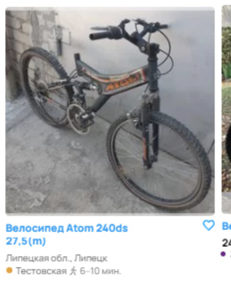

25. **Опечатка в карточке товара**
   - **Приоритет:** Low
   - **Шаги воспроизведения:** 
   1. Перейти на сайт avito.ru
   2. Посмотреть на объявления
   - **Ожидаемый результат:** Отображается существующая ветка метро
   - **Фактический результат:** Отображается несуществующая ветка метро
   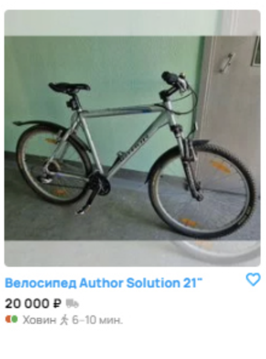

26. **Выравнивание объявлений по сетке**
   - **Приоритет:** Low
   - **Шаги воспроизведения:** 
   1. Перейти на сайт avito.ru
   2. Отсортировать по фильтрам
   3. Посмотреть на объявления
   - **Ожидаемый результат:** Карточка товара "Горный (МТВ) велосипед Author Cosmic (2019) 20''" находится наравне с соседскими карточками, карточка товара "Велосипед Atom 240ds 27,5(m)" находится наравне с соседскими карточками.
   - **Фактический результат:** Карточка товара "Горный (МТВ) велосипед Author Cosmic (2019) 20''" находится чуть выше соседних карточек, карточка товара "Велосипед Atom 240ds 27,5(m)" находится чуть ниже соседних карточек.
   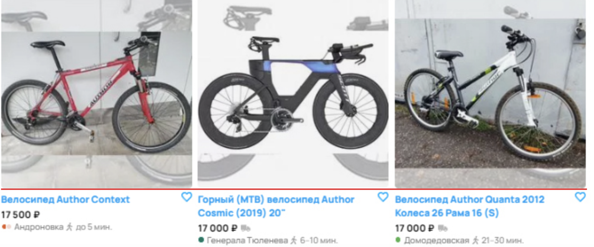

